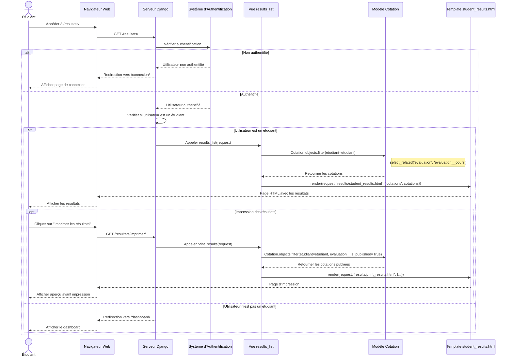

# Diagramme de Séquence - Consultation des Résultats

## Flux Principal : Étudiant consulte ses résultats



## Légende des Acteurs et Composants

| Acteur/Composant | Rôle |
|------------------|------|
| **Étudiant** | Utilisateur du système qui consulte ses résultats |
| **Navigateur Web** | Interface client (HTML/CSS/JS) |
| **Serveur Django** | Framework web Python |
| **Système d'Authentification** | Vérifie les permissions d'accès |
| **Vue results_list** | Logique métier de consultation des résultats |
| **Modèle Cotation** | Accès aux données des notes |
| **Template student_results.html** | Affichage des résultats |

## Chemins d'URL Impliqués

| URL | Vue | Description |
|-----|-----|-------------|
| `/resultats/` | `results_list` | Liste des résultats de l'étudiant |
| `/resultats/imprimer/` | `print_results` | Version imprimable des résultats |

## Modèles de Données Utilisés

```
User (Étudiant)
    └── Etudiant
        └── Cotation (note)
            └── Evaluation
                ├── Cours
                │   └── Filiere
                └── TypeEvaluation
```

## Conditions d'Accès

1. **Authentification requise** : L'utilisateur doit être connecté
2. **Rôle étudiant** : Seuls les utilisateurs avec le profil `Etudiant` peuvent accéder à cette page
3. **Évaluations publiées** : Pour l'impression, seules les évaluations avec `is_published=True` sont affichées

## Points d'Attention

- La vue `results_list` ne filtre pas par `is_published`, elle affiche toutes les cotations
- La vue `print_results` filtre uniquement les évaluations publiées
- Les notes sont affichées sur 20 avec un badge de validation (≥10 = Validé, <10 = Échec)