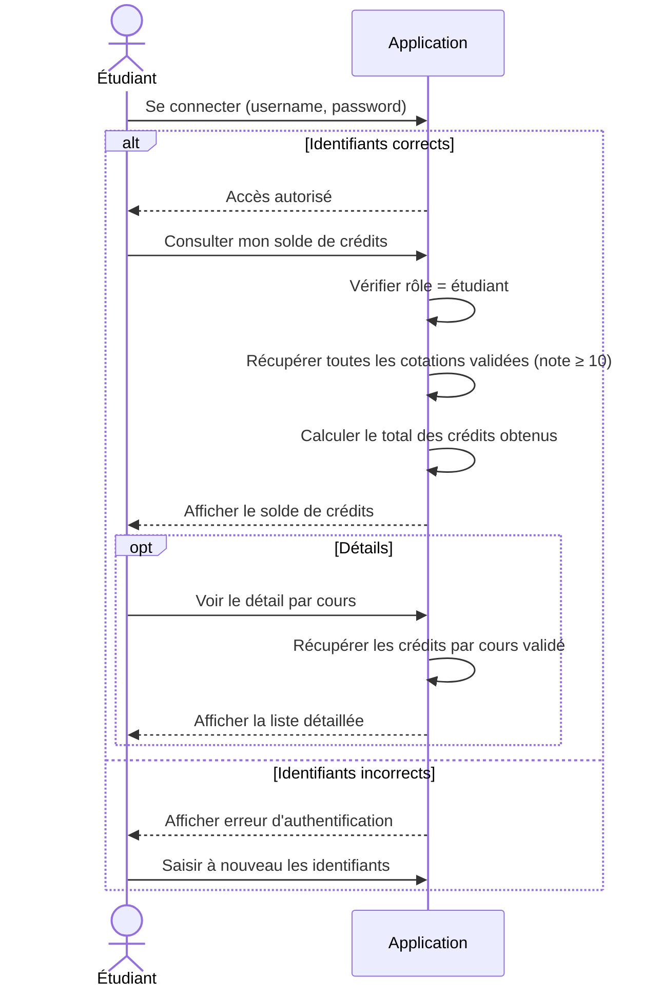

# Diagramme de Séquence - Consultation du Solde de Crédits par un Étudiant

## Flux Principal



## Étapes du Processus

### 1. Authentification
- **Action** : Connexion de l'étudiant
- **URL** : `POST /connexion/`
- **Validation** : Vérification username/password

### 2. Accès au solde
- **Action** : Consultation du solde de crédits
- **URL** : `GET /resultats/solde/` (à créer)
- **Vérification** : `hasattr(request.user, 'etudiant')`

### 3. Calcul du solde
```python
# Récupérer toutes les évaluations publiées avec notes ≥ 10
cotations_validees = Cotation.objects.filter(
    etudiant=request.user.etudiant,
    note__gte=10,
    evaluation__is_published=True
).select_related('evaluation__cours')

# Calculer le total des crédits
total_credits = sum(
    cotation.evaluation.cours.credit 
    for cotation in cotations_validees
)
```

### 4. Affichage du solde
- **Total des crédits obtenus**
- **Nombre de cours validés**
- **Moyenne générale**
- **Liste des cours avec crédits**

## Règles Métier

1. **Validation des crédits** : Un cours rapporte des crédits uniquement si la note ≥ 10
2. **Évaluations publiées** : Seules les évaluations publiées comptent
3. **Crédits par cours** : Définis dans le modèle `Cours` (champ `credit`)
4. **Cumul** : Les crédits s'accumulent sur l'ensemble de la formation

## Structure des Données

```
Etudiant (User → Etudiant)
    │
    └── Cotation (si note ≥ 10)
        │
        └── Evaluation
            │
            └── Cours
                └── credit (PositiveIntegerField)
```

## Modèle de Données Impliqué

**Modèle Cours** (app/models.py):
```python
class Cours(models.Model):
    filiere = models.ForeignKey(Filiere, on_delete=models.CASCADE)
    semestre = models.ForeignKey(Semestre, on_delete=models.CASCADE)
    annee_etude = models.ForeignKey(AnneeEtude, on_delete=models.CASCADE)
    code = models.CharField(max_length=20)
    libelle = models.CharField(max_length=100)
    volume_horaire = models.IntegerField()
    credit = models.PositiveIntegerField(default=0, verbose_name="Crédit")
```

## Composants Techniques à Créer

| Composant | Fichier | Action |
|-----------|---------|--------|
| Vue | `app/views.py` | Créer `solde_credits(request)` |
| URL | `app/urls.py` | Ajouter `path('resultats/solde/', ...)` |
| Template | `app/templates/results/solde_credits.html` | Créer l'affichage |

## Requête SQL Optimisée

```sql
SELECT 
    c.libelle,
    c.credit,
    cot.note,
    ev.date
FROM app_cotation cot
INNER JOIN app_evaluation ev ON cot.evaluation_id = ev.id
INNER JOIN app_cours c ON ev.cours_id = c.id
WHERE cot.etudiant_id = ? 
  AND cot.note >= 10
  AND ev.is_published = TRUE
ORDER BY ev.date DESC
```

## Affichage du Solde

```
┌─────────────────────────────────────┐
│  MON SOLDE DE CRÉDITS               │
├─────────────────────────────────────┤
│  Total Crédits Obtenus: 120          │
│  Cours Validés: 15                   │
│  Moyenne Générale: 12.5/20          │
└─────────────────────────────────────┘

Détail par cours:
- Algorithmique (6 cr.) - Note: 14/20
- Base de données (4 cr.) - Note: 12/20
- ...
```

## Points d'Attention

- Les crédits ne sont attribués que pour les notes ≥ 10
- Seules les évaluations publiées sont prises en compte
- Le calcul doit être dynamique (basé sur les notes actuelles)
- Possibilité de consulter l'historique par semestre/année