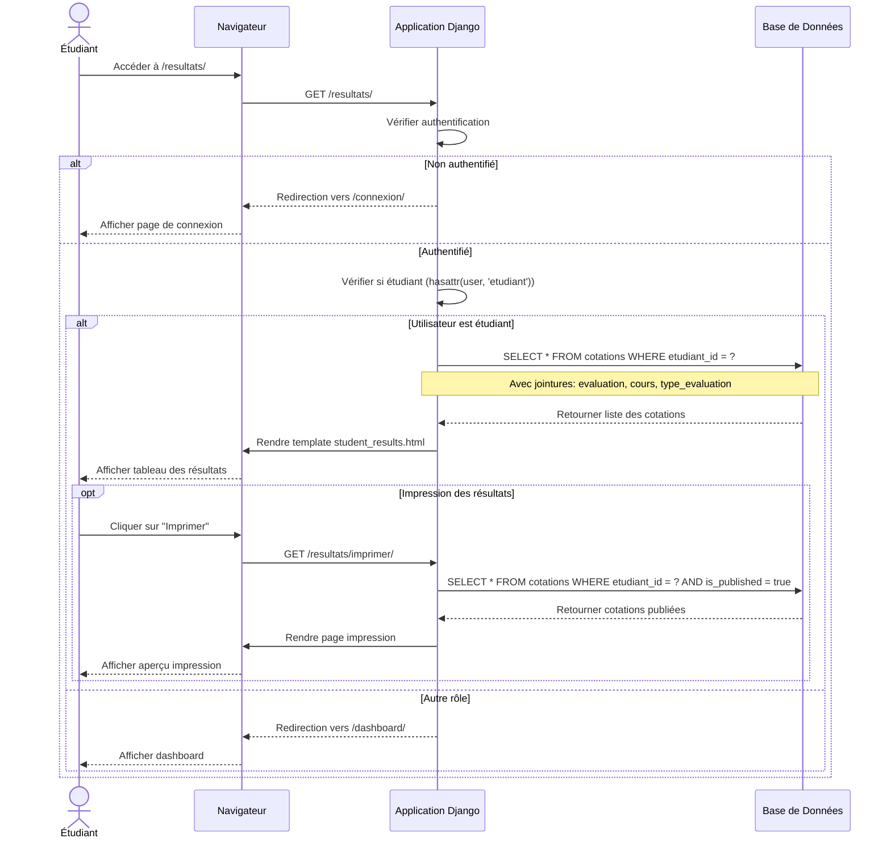

# Diagramme de Séquence - Étudiant Consulte ses Résultats

## Flux Principal



## Composants du Système

| Composant | Rôle |
|-----------|------|
| **Étudiant** | Utilisateur qui consulte ses résultats |
| **Navigateur** | Interface web (HTML/CSS/JS) |
| **Django** | Framework web (vues, authentification) |
| **Base de Données** | Stockage des cotations et évaluations |

## URLs Impliquées

| URL | Méthode | Vue | Description |
|-----|---------|-----|-------------|
| `/resultats/` | GET | `results_list` | Liste des résultats |
| `/resultats/imprimer/` | GET | `print_results` | Version imprimable |

## Vérifications Effectuées

1. **Authentification** : `request.user.is_authenticated`
2. **Rôle étudiant** : `hasattr(request.user, 'etudiant')`
3. **Filtrage des données** : Par étudiant connecté

## Données Récupérées

```python
# Vue results_list
Cotation.objects.filter(
    etudiant=request.user.etudiant
).select_related(
    'evaluation',
    'evaluation__cours',
    'evaluation__type_evaluation'
)

# Vue print_results (avec filtre supplémentaire)
Cotation.objects.filter(
    etudiant=request.user.etudiant,
    evaluation__is_published=True
).select_related(
    'evaluation',
    'evaluation__cours',
    'evaluation__type_evaluation'
)
```

## Informations Affichées

- Cours
- Type d'évaluation
- Date de l'évaluation
- Note (/20)
- Résultat (Validé ≥10 / Échec <10)

## Règles Métier

1. **Accès restreint** : Étudiant authentifié uniquement
2. **Isolation des données** : Un étudiant voit uniquement ses propres résultats
3. **Publication** : Impression réservée aux évaluations publiées
4. **Validation** : Note ≥ 10 = Validé, < 10 = Échec

## Modèle de Données

```
User (Étudiant)
    └── Etudiant
        └── Cotation
            ├── note (DecimalField)
            └── Evaluation
                ├── date
                ├── is_published
                ├── Cours
                │   ├── libelle
                │   └── credit
                └── TypeEvaluation
                    └── libelle