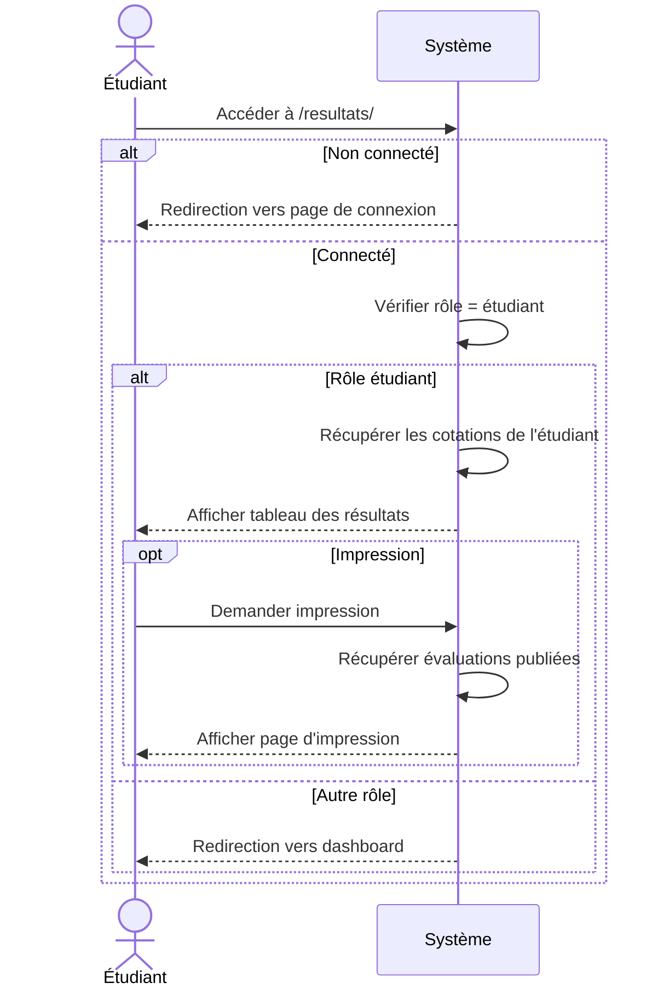

# Diagramme de Séquence - Consultation des Résultats par un Étudiant

## Flux Simplifié



## Description du Flux

### 1. Accès à la page des résultats
- **URL** : `GET /resultats/`
- **Acteur** : Étudiant connecté

### 2. Vérifications
- Authentification : `request.user.is_authenticated`
- Rôle : `hasattr(request.user, 'etudiant')`

### 3. Récupération des données
```python
Cotation.objects.filter(
    etudiant=request.user.etudiant
).select_related(
    'evaluation__cours',
    'evaluation__type_evaluation'
)
```

### 4. Affichage
- Template : `student_results.html`
- Informations affichées :
  - Cours
  - Type d'évaluation
  - Date
  - Note (/20)
  - Statut (Validé ≥10 / Échec <10)

### 5. Impression (optionnel)
- **URL** : `GET /resultats/imprimer/`
- **Filtre** : `evaluation__is_published=True`

## Composants Techniques

| Composant | Fichier | Fonction |
|-----------|---------|----------|
| Vue | `app/views.py` | `results_list()` |
| Vue Impression | `app/views.py` | `print_results()` |
| URL | `app/urls.py` | `/resultats/` |
| Template | `app/templates/results/student_results.html` | Affichage |

## Modèle de Données

```
Etudiant (1) ──→ (N) Cotation (N) ──→ (1) Evaluation
                                              ├── Cours
                                              └── TypeEvaluation
```

## Règles

- ✅ Accès : Étudiant authentifié uniquement
- ✅ Données : Toutes les cotations (page normale)
- ✅ Données : Cotations publiées uniquement (impression)
- ✅ Validation : ≥10 = Validé, <10 = Échec